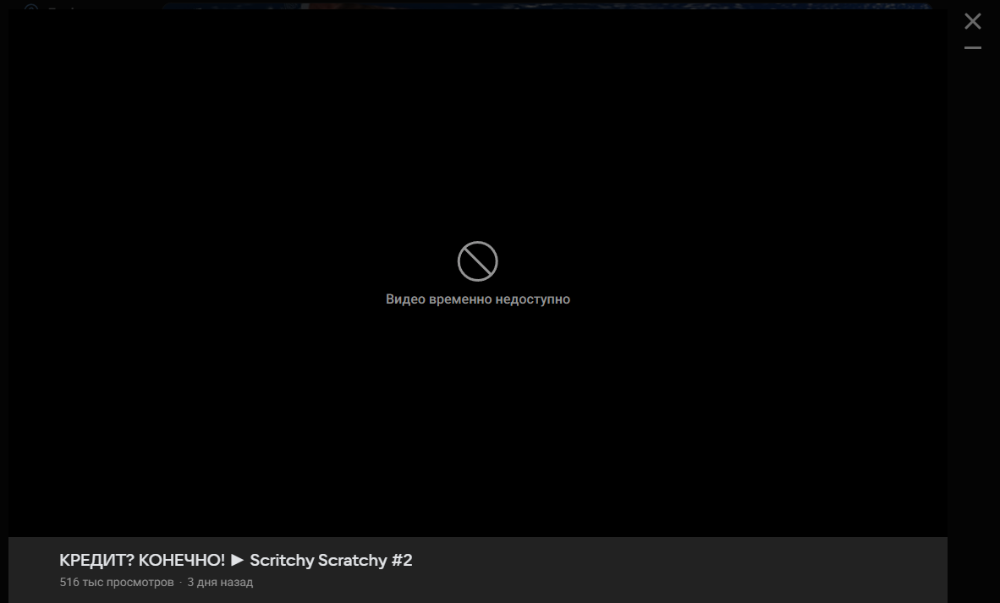
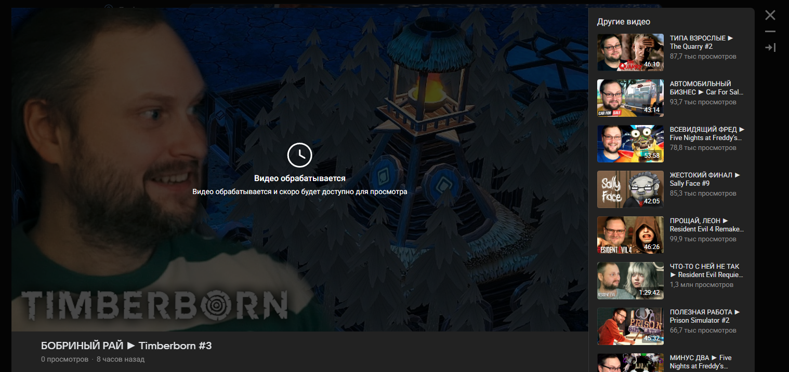
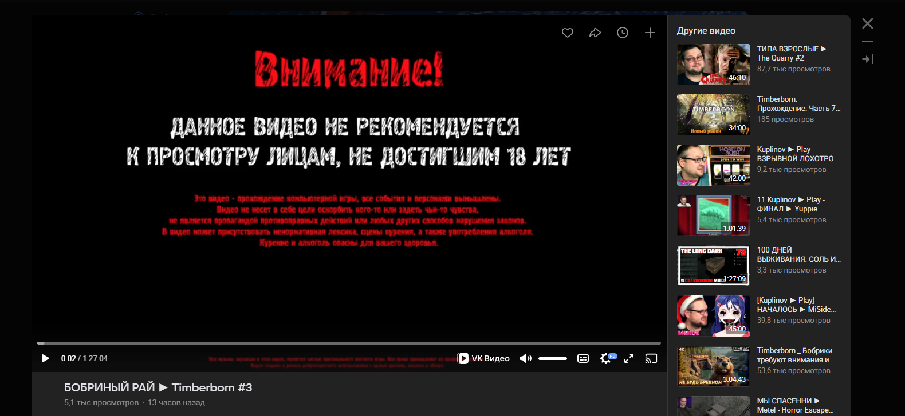

## Предисловие

Я особо не пользуюсь VK и вообще стараюсь не пользоваться этой социальной сетью — интерфейс перегружен, рекламы слишком много, а техническое качество оставляет желать лучшего. Но иногда там выходят эксклюзивные видео, которые нигде больше не найти. И вот 23 марта 2026 года я, скрепя сердце, открыл VK, чтобы посмотреть новое видео одного известного блогера.

Звук пропадал. Не через ровные промежутки, а на случайных отметках — мог пропасть дважды за пару секунд, а мог раз в минуту. Иногда пропадал насовсем, и только полная очистка кэша страницы помогала вернуть его — но тогда пропадал выбор качества.

Я зашёл в комментарии. Тысячи сообщений с той же проблемой. Один из пользователей привёл ответ поддержки VK: *«Блогер недавно начал использовать новый кодек, это проблема из-за него»*.

Меня это насторожило. Если проблема в «новом кодеке», почему она массовая? И почему её не исправляют уже несколько дней?

Я технически подкованный пользователь, но в расследованиях полный профан. Тем не менее, я решил провести собственный анализ. В этом мне помогала нейросеть, с которой мы шаг за шагом разбирали данные, строили гипотезы и проверяли их.

То, что мы обнаружили, оказалось не просто багом в плеере, а системной проблемой, которая стоит пользователям гигабайтов трафика и денег, а платформе — доверия и смысла существования.

---

### TL;DR (Краткое содержание)

**Что случилось:**
С 23 марта (а возможно и раньше) у многих новых видео в VK пропадает звук на случайных отметках. Баг затрагивает тысячи пользователей и десятки популярных каналов. В центре расследования — видео Куплинова `«КРЕДИТ？ КОНЕЧНО! ► Scritchy Scratchy #2»`, опубликованное 26 марта в 18:00 по системе отложенной публикации.

**Что мы выяснили:**
VK публикует видео **до того, как закончит их обработку**. В момент публикации на сервере есть только исходный файл (или промежуточная копия) с чудовищно высоким битрейтом — 41,6 Мбит/с вместо нормальных ~5,6 Мбит/с. В результате пользователи скачивают 26 ГБ вместо 3,5 ГБ.

Для сломанного видео **не был создан DASH-манифест**. Без манифеста плеер не может работать в нормальном режиме: нет выбора качества, нет стабильного звука. Плеер падает в fallback-режим и при этом врёт пользователю о качестве: когда он показывает «144p», на самом деле воспроизводится 4K-исходник.

Спустя 94 часа VK не починил видео, а **спрятал его** за статусом «Видео временно недоступно» — тем же статусом, который используется для заблокированного контента. При этом 26-гигабайтный файл **по-прежнему лежит на CDN** и доступен по прямой ссылке. VK не перезапустил обработку, не удалил мусор, не создал нормальную версию. Он просто убрал видео из интерфейса.

Тем временем эксклюзив истёк. Видео вышло на YouTube и работает идеально. А новое видео того же автора, опубликованное 29 марта, спустя несколько часов после запланированной публикации всё ещё находится в статусе «обрабатывается».

**Почему это важно:**
- **Для пользователей:** один полный просмотр «битого» видео — это 26 ГБ трафика. Для лимитных тарифов это может стать мгновенным исчерпанием лимита.
- **Для авторов:** VK не может гарантировать работоспособность эксклюзивного контента, который получает в рамках партнёрства с авторами.
- **Для платформы:** пользователи уходят на YouTube, пиратят контент через Яндекс.Диск и открыто высмеивают VK в комментариях. Платформа теряет не просмотры — она теряет смысл.

---

## Глава 1: Как я заметил проблему

23 марта я открыл VK, чтобы посмотреть новое видео блогера (1 час 30 минут, 4K, 60 fps). В браузерном плеере звук пропадал на случайных отметках. Перемотка часто приводила к полной потере звука. Очистка кэша помогала временно, но после перезагрузки страницы баг возвращался.

В комментариях к видео были тысячи жалоб с теми же симптомами. Один пользователь привёл ответ поддержки VK: *«Блогер недавно начал использовать новый кодек, это проблема из-за него»*.

К 27 марта проблема не только не исчезла, но VK в целом стал тормозить сильнее обычного.

Я решил разобраться, что происходит на самом деле.

### TL;DR
>  23 марта 2026 года у видео на VK пропадает звук на случайных отметках. Тысячи пользователей жалуются на ту же проблему. Поддержка VK обвиняет автора видео: «блогер начал использовать новый кодек». Проблема не исчезает несколько дней. Я решаю разобраться сам.
---

## Глава 2: Ложные гипотезы

Прежде чем выйти на правильный ответ, я проверил несколько гипотез, которые оказались ложными. Привожу их здесь, потому что они показывают, как работал процесс анализа, — и потому что каждая ложная гипотеза приближала к истине.

### Гипотеза 1: Проблема в DASH-манифесте

Я открыл прямую ссылку на видео в VLC. VLC не использует DASH-манифест, он читает файл напрямую. Если бы проблема была только в манифесте, VLC играл бы идеально.

VLC *спотыкался* — видео и звук замирали на случайных отметках, но звук не пропадал насовсем.

**Вывод:** проблема не только в манифесте, но и в самом файле.

### Гипотеза 2: Файл «раздувается» из-за склейки сегментов

Я скачал видео через cobalt.tools. Размер файла оказался **26 ГБ** вместо ожидаемых 3–4 ГБ. Я предположил, что кодировщик VK накапливает DASH-сегменты, склеивая тысячи копий в один файл.

Анализ через MediaInfo и ffprobe показал, что в файле **один** видеопоток (H.264), количество кадров (322 262) соответствует длительности (1 час 29 минут), а битрейт — 41,6 Мбит/с. Файл не склеен из множества копий. Он просто имеет чудовищно высокий битрейт — это исходник или промежуточная копия, не прошедшая финальное сжатие.

### Гипотеза 3: Проблема в новом кодеке (H.265/AV1)

Ответ поддержки намекал, что блогер начал использовать новый кодек. Я предположил, что VK не умеет правильно обрабатывать H.265 или AV1.

Нормальная версия (которая появилась у других видео того же автора) тоже оказалась H.264, но с битрейтом ~5,6 Мбит/с. Кодек не изменился — изменились настройки сжатия. А свежие видео того же автора работали нормально с самого начала.

**Вывод:** проблема не в кодеке и не в авторе.

### TL;DR
> Проверены три гипотезы — все ложные. Проблема не только в DASH-манифесте (VLC тоже спотыкается). Файл не «раздут» склейкой сегментов (один поток, корректное количество кадров, просто чудовищный битрейт — 41,6 Мбит/с). Проблема не в новом кодеке (и сломанное, и рабочее видео используют H.264). Каждая ложная гипотеза приближала к правильному ответу.
---

## Глава 3: Что происходит на самом деле

Когда я сравнил «битую» и нормальную версии, картина сложилась.

| Параметр | «Битая» версия (26 марта) | Нормальная версия (свежее видео) |
|----------|--------------------------|----------------------------------|
| Размер | 26 ГБ | 1,2 ГБ |
| Битрейт (видео) | 41,6 Мбит/с | ~5 Мбит/с |
| Кодек | H.264 | H.264 |
| Количество кадров | 322 262 | Соответствует длительности |
| Выбор качества в плеере | Иллюзия ([см. главу 6](#глава-6-иллюзия-качества--как-плеер-обманывает-пользователей)) | Работает полноценно |
| Звук | Пропадает на случайных отметках | Работает нормально |
| DASH-манифест | Отсутствует | Присутствует |

> **Примечание:** размер файла — 28 204 250 998 байт. Это 28,2 ГБ в десятичной системе (1 ГБ = 1 000 000 000 байт) или 26,3 ГиБ в двоичной (1 ГиБ = 1 073 741 824 байт). MediaInfo и большинство ОС показывают 26,3 ГБ (используя двоичные единицы с десятичным обозначением). В тексте используется округлённое значение 26 ГБ.

**Ключевой вывод:**
VK публикует видео **моментально**, используя исходный файл с высоким битрейтом. Перекодировка (сжатие, создание нескольких качеств, генерация DASH-манифеста) происходит **в фоне, после публикации**, и может занимать часы или сутки. Для этого конкретного видео процесс сломался: манифест не был создан, нормальные качества не появились.

### TL;DR
> Сравнение сломанной и нормальной версий показало: VK публикует видео до завершения обработки. Пользователи получают исходник (26 ГБ, 41 Мбит/с) вместо сжатой версии (3,5 ГБ, ~5 Мбит/с). Кодек тот же, длительность та же, количество кадров то же — но размер отличается в 22 раза. DASH-манифест для сломанного видео не был создан.
---

## Глава 4: Как это должно работать и как работает

**Нормальный процесс (как должно быть):**

1. Автор загружает видео
2. VK перекодирует его: сжимает, создаёт 720p, 1080p, 4K, генерирует DASH-манифест
3. Видео публикуется **после завершения перекодировки**
4. Пользователи получают сжатые файлы, работающий звук, выбор качества

**Реальный процесс (что происходит сейчас):**

1. Автор загружает видео
2. VK **немедленно публикует** его, используя исходник с высоким битрейтом (41 Мбит/с, 26 ГБ)
3. В фоне запускается перекодировка
4. Если перекодировка завершается — видео «чинится» незаметно для пользователя
5. Если перекодировка сбоит — видео остаётся сломанным на неопределённый срок

**Что случилось с этим видео:**

Перекодировка не завершилась. Манифест не был создан. Нормальные качества не появились. На CDN остался 26-гигабайтный исходник. Видео провисело в таком состоянии 94 часа, после чего VK спрятал его за заглушкой — но не починил и не удалил мусор.

### TL;DR
> Нормальный процесс: загрузка → обработка → публикация. Реальный процесс VK: загрузка → публикация → обработка в фоне. Если обработка сбоит — видео остаётся сломанным на неопределённый срок. Для конкретного видео обработка сломалась: нет манифеста, нет сжатых версий, на CDN лежит только 26-гигабайтный исходник.

---

## Глава 5: Анализ файла — что лежит на серверах VK

В ходе расследования был получен и проанализирован файл сломанного видео (публикация от 26 марта). Прямая ссылка на файл была извлечена из DevTools браузера.

**MediaInfo:**
```
Общее
Формат                                   : MPEG-4
Профиль формата                          : Base Media / Version 2
Размер файла                             : 26,3 Гбайт
Продолжительность                        : 1 ч. 29 м.
Общий битрейт                            : 42,0 Мбит/сек
Частота кадров                           : 59,940 кадров/сек

Видео
Формат                                   : AVC
Профиль формата                          : High@L5.2
Битрейт                                  : 41,6 Мбит/сек
Ширина                                   : 3 840 пикселей
Высота                                   : 2 160 пикселей
Размер потока                            : 26,1 Гбайт (99%)

Аудио
Формат                                   : AAC LC
Битрейт                                  : 317 Кбит/сек
Каналы                                   : 2 канала
Частота дискретизации                    : 48,0 КГц
Размер потока                            : 203 Мбайт (1%)
```

**ffprobe:**
```
[STREAM]
index=0
codec_name=h264
width=3840
height=2160
bit_rate=41645126
nb_frames=322262
duration=5376.404367
[/STREAM]

[STREAM]
index=1
codec_name=aac
bit_rate=317373
nb_frames=252020
[/STREAM]

[FORMAT]
size=28204250998
bit_rate=41967454
[/FORMAT]
```

**curl-запрос:**
```
curl -i "https://vkvd513.okcdn.ru/...&id=12365823478293"

HTTP/1.1 200 OK
Content-Length: 28204250998
Content-Type: video/mp4
Accept-Ranges: bytes
```

**Для сравнения** — свежее видео того же автора (третья часть), вышедшее позже:

```
Размер файла                             : 1,20 Гбайт
Общий битрейт                            : 5,6 Мбит/сек
Видео                                    : AVC
Ширина                                   : 3 840 пикселей
Высота                                   : 2 160 пикселей
```

Один и тот же автор, один и тот же кодек, сопоставимая длительность. Но размер отличается в **22 раза**.

**Примечание к прямой ссылке:** ссылка на 26 ГБ файл содержит параметр `expires=1775017401184` (1 апреля 2026 года). На момент публикации расследования (29 марта) ссылка работает. После истечения срока файл может стать недоступным по этой ссылке, но это не означает, что он будет удалён с CDN — он может остаться без внешнего доступа, продолжая занимать место на серверах.

### TL;DR
> MediaInfo и ffprobe подтверждают: файл структурно цел (один видеопоток H.264 High@L5.2, один аудиопоток AAC, 322 262 кадра). Это не повреждённый файл, а необработанный — исходник до финального сжатия. Битрейт 41,6 Мбит/с, размер 28 204 250 998 байт. Для сравнения: нормально обработанное видео того же автора — 1,2 ГБ, ~5,6 Мбит/с. Прямая ссылка на файл работает на момент расследования (29 марта), срок истечения — 1 апреля.
---

## Глава 6: Иллюзия качества — как плеер обманывает пользователей

Когда плеер VK падает в режим прямой ссылки на MP4 (из-за отсутствия манифеста), он показывает выбор качества. Но это **иллюзия**.

**Что происходит:**

- На сервере нет отдельных файлов 720p, 1080p, 144p
- Есть только 4K-исходник (26 ГБ)
- Плеер **масштабирует** этот исходник до выбранного разрешения на стороне клиента
- Трафик при этом не уменьшается — браузер всё равно скачивает данные с битрейтом 41 Мбит/с

**Особенно показательный случай:** когда плеер показывает, что доступно **только качество 144p**, он на самом деле воспроизводит 4K-исходник, просто *называет* его 144p. Пользователь думает, что экономит трафик. На самом деле — нет.

*Оговорка:* браузер использует HTTP Range-запросы и не скачивает весь файл сразу. Однако битрейт потока остаётся 41 Мбит/с вместо нормальных ~5 Мбит/с. За час просмотра пользователь скачает до **18 ГБ** вместо **2,5 ГБ**. Для лимитных мобильных тарифов (30–50 ГБ/мес) это может означать исчерпание месячного лимита за один просмотр.

### TL;DR
> Плеер VK показывает выбор качества (144p, 720p, 1080p, 4K), но это иллюзия. На сервере только один файл — 4K-исходник. Плеер масштабирует его на стороне клиента, а трафик остаётся 41 Мбит/с. Когда пользователь выбирает «144p», он на самом деле качает 4K. За час просмотра — до 18 ГБ вместо нормальных 2,5 ГБ. Для лимитных мобильных тарифов это может означать исчерпание месячного лимита за один просмотр.
---

## Глава 7: Отсутствие манифеста — корень проблемы

У сломанного видео **отсутствует DASH-манифест**. Не «битый манифест» — полное отсутствие.

**Что это значит технически:**

Без манифеста плеер VK не знает, какие качества доступны, как нарезаны сегменты, где находится звуковая дорожка. Он падает в fallback-режимы:

1. **Blob-режим.** Плеер пытается собрать видео из сегментов в памяти браузера. Это работает нестабильно, звук может пропадать.
2. **Прямая ссылка на MP4.** Плеер открывает 26-гигабайтный файл напрямую.

**Эксперимент с перезагрузками:**

Для рабочего видео — только blob, никакой прямой ссылки. Для сломанного — иногда blob (нестабильно), иногда прямая ссылка на MP4. Это прямое подтверждение: проблема в отсутствии манифеста.

### TL;DR
> У сломанного видео полностью отсутствует DASH-манифест. Без манифеста плеер не знает, какие качества доступны и как нарезаны сегменты. Он падает в fallback: нестабильный blob-режим или прямая ссылка на 26-гигабайтный MP4. У рабочих видео — только blob, никакой прямой ссылки. Это прямое подтверждение: корень проблемы — отсутствие манифеста.
---

## Глава 8: Даже «рабочее» видео не идеально

При просмотре третьей части — которая считается «рабочей» — были обнаружены множественные сбои. Начиная с 41-й минуты видео начало «спотыкаться»: воспроизведение прерывалось, как при обновлении страницы. Было зафиксировано шесть сбоев — три на отметке 41:00 и три на 41:31.

После шестого сбоя видео ушло в бесконечную буферизацию. Только полная перезагрузка страницы позволила продолжить просмотр.

**Что это значит:**

Повторяемость сбоев на конкретных таймкодах указывает на проблему в сегментации — вероятно, повреждённый сегмент или ошибка в DASH-манифесте в районе 41-й минуты. Сетевые проблемы были бы случайными, а здесь — чёткая привязка к таймкоду.

*Оговорка:* наблюдение сделано в одном сеансе просмотра в одном браузере. Сбои могут быть связаны с конкретной CDN-нодой, а не с дефектом файла. Для окончательного подтверждения нужна проверка в нескольких браузерах и анализ DASH-манифеста. Тем не менее, привязка сбоев к конкретным таймкодам — сильный индикатор проблемы на стороне сервера, а не сети.

**Вывод:** разница между сломанной второй частью и «рабочей» третьей — не в наличии дефектов, а в их степени. Вторая сломана полностью (нет звука, нет манифеста, 26 ГБ). Третья — частично (сбои на конкретных минутах, остановки воспроизведения). И то, и другое — следствие проблем с обработкой видео на платформе.

### TL;DR
> Третья часть (считающаяся нормальной) тоже имеет дефекты: шесть сбоев воспроизведения на отметках 41:00 и 41:31, бесконечная буферизация после шестого сбоя. Привязка сбоев к конкретным таймкодам указывает на дефект в файле или манифесте, а не на сетевую проблему. Разница между «сломанным» и «рабочим» видео — не бинарная, а градиентная: степень повреждения разная, но проблемы обработки по видимому затрагивают оба видео.

---

## Глава 9: Что писали пользователи — хроника в реальном времени

В комментариях к сломанному видео развернулась хроника. Тысячи сообщений, сотни уникальных пользователей.

Среди просмотренных комментариев подавляющее большинство сообщало о проблемах со звуком. Комментарии, в которых пользователи утверждали, что звук работает нормально, встречались, но были в явном меньшинстве и часто опровергались другими пользователями в ответах.

**Пользователи засекают время:**

- *«Сутки видос висел, а звук так и пропадает»* — 17:09
- *«по состоянию на 17:30 МСК 27 марта 2026 звук так и не появился. то есть, - прошли сутки»* — 17:33
- *«Сутки прошли. Звука нет»* — 18:11
- *«28 часов, а вк так и не обработал видео»* — 19:09
- *«Больше суток прошло. Видео до сих пор рендерится?»* — 19:27

**Пользователи находят аномальный размер:**

- *«Скачивание видоса с любого сайта 26 Гб, сильно🙈 чего там нам отсыпал Куплинов?»* — 17:54
- *«тепер звук есть но и жор тоже разрешение видео осталось только 144р но это не так сюда по качесту видео 26гег весит видео вот и жор инета»* — 17:57

**Пользователи тестируют обходные пути:**

- *«Лайфхак: открываете Яндекс браузер, просто в поисковике вбиваете куплинов Scritchy Scratchy #2, и просто на странице браузера запускаете это видео. Вот при таком просмотре, видео из ВК не лагает»* — 17:36
- *«В Яндексе нормально все со звуком»* — 18:09
- *«С ВПН нормально работает»* — 18:28

**Пользователи фиксируют, что выбор качества не работает:**

- *«На 2160 пи нету половина звуков. На 1080 пи все норм»* — 18:16
- *«у меня даже на 720 нет звука»* — 18:32
- *«Даже на 4к нет звука»* — 18:32

**Пользователи уходят на YouTube:**

- *«На другой платформе быстрей выйдет, чем звук тут будет. Смысла ждать тут уже не вижу»* — 17:52
- *«Звука до сих пор нет, посмотрю уже на YouTube… Vk помойка.»* — 18:00
- *«Ладно, подождем 2 часть на ютубе»* — 20:25

**Эмоции:**

- *«ВК контора пид_расов, все у них вечно через ж_пу.»* — 18:34
- *«Сутки прошли, СУТКИ. Ало. Невозможно посмотреть.»* — 18:28
- *«ВК пробивает дно😐»* — 19:15

**Пользователи начинают сравнивать и делать выводы:**

- *«Именно это видео лагает, сегодняшнее норм»* — 19:56
- *«Проблема в самом видео, так как сегодняшнее видео норм работает»* — 20:14
- *«потому что все остальные видосы, которые были выложены в это же время у других (тоже в 4к) работают без проблем. Не может быть так, что видео не работает только у Куплинова.»* — 22:07

### TL;DR
> Тысячи комментариев документируют проблему в реальном времени. Пользователи засекают время (сутки, 28 часов, больше суток). Обнаруживают аномальный размер файла (26 ГБ). Тестируют обходные пути (Яндекс.Браузер, VPN — с переменным успехом). Замечают, что выбор качества не работает. Уходят на YouTube. Сравнивают с другими видео того же автора и делают правильный вывод: проблема не в авторе и не в кодеке, а в платформе.
---

## Глава 10: Два новых видео работают — проблема не в авторе

Пока сломанное видео висело 94 часа, Куплинов выпустил **два новых видео**. Оба работают нормально.

Третья часть по той же игре: нормальный размер (1,2 ГБ), корректный манифест, работающий звук, выбор качества. Тот же автор, тот же кодек (H.264), сопоставимая длительность и разрешение.

Пользователи под третьей частью написали: *«Ура́а́аааааа со звуком»* — радуясь тому, что новое видео не сломано. Нормальное воспроизведение, которое должно быть стандартом, вызвало у них радость и облегчение.

**Что это доказывает:**

- Проблема не в авторе. Куплинов не менял кодек, не менял настройки.
- Проблема не в кодеке. Иначе новые видео тоже были бы сломаны.
- Проблема не в длительности или разрешении.
- **Проблема в том, что VK сломал обработку конкретного видео и не смог (или не захотел) её починить.**

### TL;DR
> За 94 часа, пока сломанное видео висело, Куплинов выпустил два новых видео — оба работают нормально. Тот же автор, тот же кодек, сопоставимая длительность и разрешение. Это убивает все объяснения со стороны VK («новый кодек», «проблема у автора»). Проблема в том, что VK сломал обработку конкретного видео и не смог или не захотел её починить.
---

## Глава 11: Пользователи пиратят контент с VK

Через 40 часов после публикации, когда видео так и не было починено, один из пользователей скачал 26-гигабайтный файл и выложил его на Яндекс.Диск. На момент обнаружения ссылки файл имел 896 открытий страницы и был скачан 33 раза.

33 человека потратили по 26 ГБ трафика каждый — суммарно **858 ГБ** — чтобы скачать сломанное видео со стороннего хостинга. Плюс загрузчик потратил 26 ГБ на скачивание с VK и столько же на загрузку на Яндекс.Диск.

Парадокс: баг VK превращает лояльных зрителей в пиратов. Пользователь, выложивший видео на Яндекс.Диск, формально нарушает авторские права Куплинова. Но он делает это не из корыстных побуждений, а потому что платформа, на которой видео опубликовано официально, не может его воспроизвести.

Это индикатор того, насколько далеко готовы зайти пользователи, чтобы обойти проблему, которую VK не решает.

### TL;DR
> Один из пользователей скачал 26-гигабайтный файл и выложил на Яндекс.Диск. 896 просмотров страницы, 33 скачивания — суммарно 858 ГБ трафика. Баг VK превращает лояльных зрителей в пиратов: они нарушают авторские права не из корысти, а потому что платформа, где видео опубликовано официально, не может его воспроизвести.
---

## Глава 12: 94 часа — хронология провала

Метаданные файла показывают дату создания: **25 марта, 11:20**. Публикация была запланирована на **26 марта, 18:00** (через систему отложенной публикации — Куплинов публикует видео на VK на три дня раньше, чем на YouTube, о чём пишет в своём [Telegram-канале](https://t.me/Kuplinov_Telegram)).

*Примечание:* дата 25 марта, 11:20 получена из метаданных скачанного файла. Она может отражать момент создания файла автором, а не момент загрузки на VK. Точное время загрузки на серверы VK неизвестно — API не предоставляет эту информацию для видео в текущем статусе. Однако, учитывая паттерн отложенной публикации (загрузка за сутки или более до выхода), VK располагал как минимум сутками на обработку.

**Хронология:**

| Дата и время | Событие |
|-------------|---------|
| 25 марта, 11:20 | Файл создан (по метаданным) |
| 26 марта, 18:00 | Запланированная публикация. **Обработка не завершена.**<br> Пользователи получают сырой файл (26 ГБ) |
| 26 марта, вечер | **Массовые жалобы на отсутствие звука** |
| 27 марта, 17:00–19:00 | Пользователи засекают: **прошли сутки, проблема не решена** |
| 27 марта, 17:54 | Пользователи обнаруживают **аномальный размер файла** (26 ГБ) |
| 28 марта | Выходят два новых видео Куплинова — оба работают нормально |
| 28 марта | Пользователь выкладывает 26 ГБ файл на Яндекс.Диск |
| 29 марта, ~09:47 | **VK скрывает видео.** <br> Статус: «Видео временно недоступно» |
| 29 марта, 18:00 | Запланированная публикация нового видео. <br>Статус: «Видео обрабатывается» |
| 29 марта, 18:47 | **Сломанное видео выходит на YouTube**. Работает идеально |
| 29 марта, 21:00 | Новое видео (3 часа после публикации) всё ещё «обрабатывается». <br>**Сломанное — всё ещё «недоступно»**. <br>Прямая ссылка на **26 ГБ — всё ещё работает** |
| 29 марта, 23:26 | Новое видео — 5,5 часов после публикации.<br>Статус: «обрабатывается».<br>Пользователи ссылаются на предыдущий случай, просят Куплинова уйти с VK, уходят на YouTube |
| 30 марта, ~07:00 | Новое видео (29 марта) наконец обработалось — спустя 13 часов. Сломанное — по-прежнему «временно недоступно» |

- **Итого:** От публикации до скрытия — 64 часа. От создания файла (по метаданным) до скрытия — 94 часа. В любом случае — VK не смог обработать видео за несколько суток.

### TL;DR
> От публикации (26 марта, 18:00) до скрытия — 64 часа. От создания файла (по метаданным, 25 марта) до скрытия — 94 часа. За это время VK не создал нормальную версию, не создал манифест, не удалил промежуточные файлы. Результатом стало не исправление, а сокрытие. 26 ГБ мусора остаётся на CDN и доступен по прямой ссылке.
---

## Глава 13: Два статуса и два приговора

29 марта на канале Куплинова в VK можно наблюдать два видео с двумя разными заглушками:

**Сломанное видео (26 марта):**
> «Видео временно недоступно»<br>
> Лента рекомендаций: **отсутствует**

*На скриншоте (30 марта 00:24): 516 тыс просмотров - 3 дня назад*

**Новое видео (29 марта):**
> «Видео обрабатывается и скоро будет доступно для просмотра»<br>
> Лента рекомендаций: **присутствует**

*На скриншоте (30 марта 02:38): 0 просмотров - 8 часов назад*

**Тоже видео (30 марта):**
> 
*На скриншоте (30 марта 07:37): 5,1 тыс просмотров - 13 часов назад*

И это различие принципиально.

Статус «обрабатывается» — это активный статус. VK как бы говорит: мы работаем, ждите. Рекомендации показываются, чтобы удержать пользователя на платформе. А вот статус «временно недоступно» — это уже скорее всего статус блокировки. Он используется для видео, заблокированных по жалобам правообладателей или решению модерации. Рекомендаций нет. Пользователю некуда идти, кроме как закрыть окно.

VK **мог** присвоить сломанному видео статус «обрабатывается» — тот же, что у нового видео. Он этого не сделал. Потому что обработку он по всей видимости не запустил. Это подтверждается тем, что 26 ГБ файл **по-прежнему доступен** по прямой ссылке на CDN. Его можно открыть в VLC, скачать через wget. VK не перекодировал файл, не создал нормальную версию, не удалил мусор. Он выполнил ровно одно действие — убрал видео из интерфейса. Изменил флаг видимости в базе данных.

**Дополнительный вывод:** в системе VK, вероятно, не существует статуса «обработка не удалась». Сценарий, при котором перекодировка сбоит и видео нужно обработать заново, не был предусмотрен при проектировании. Когда этот сценарий наступил, VK воспользовался единственным подходящим инструментом — блокировкой.

### TL;DR
> VK использует два разных статуса: «Обрабатывается» (с рекомендациями, с обещанием результата) и «Временно недоступно» (без рекомендаций, без обещаний). Сломанное видео получило второй статус — типичный для заблокированного контента, а не для обрабатываемого. VK мог присвоить статус обработки, но не сделал этого — потому что обработку не запустил. В системе VK, вероятно, не существует статуса «обработка не удалась» — этот сценарий не был предусмотрен при проектировании.
---

## Глава 14: Эксклюзив истёк — видео ушло на YouTube

29 марта в 18:47 сломанное видео вышло на YouTube. Оно работает идеально. Звук есть. Качество нормальное. Размер — не 26 ГБ.

Куплинов публикует видео на VK на три дня раньше, чем на YouTube, — об этом он пишет в своём [Telegram-канале](https://t.me/Kuplinov_Telegram). Это эксклюзивное окно, за которое VK, предположительно, платит в рамках партнёрского контракта.

Эксклюзивное окно для сломанного видео истекло. VK не смог предоставить пользователям рабочее видео за три дня. Не смог за 94 часа. Не смог вообще.

Тем временем новое видео, опубликованное 29 марта в 18:00, к 21:00 всё ещё находится в статусе «обрабатывается». Три часа после запланированной публикации — и видео недоступно. Если следовать паттерну предыдущего видео (загрузка за сутки до публикации), обработка не завершилась за 24+ часов.

*Оговорка:* точное время загрузки нового видео неизвестно — API не предоставляет эту информацию для видео в статусе обработки. Три часа задержки сами по себе не являются катастрофой (YouTube тоже может обрабатывать 4K/60fps-видео до нескольких часов). Однако в контексте предыдущего провала (94 часа без результата) и свидетельств пользователей о системных проблемах с обработкой — это тревожный сигнал.

К 23:00 новое видео Куплинова находится в обработке пять часов. Пользователи в комментариях уже проводят параллели с предыдущим случаем: «Как раз через 3 дня обработается». Другие открыто заявляют о намерении уйти на YouTube: «Ну на ютубе походу быстрее посмотрим чем тут». Эксклюзивное окно формально ещё действует — но пользователям уже всё равно.

Эксклюзивный контракт, задуманный как преимущество VK, превратился в наказание для аудитории. Доступ к видео «на три дня раньше» не был получен никем. YouTube не может показать контент, который ещё не получил. Пользователь оказывается между двумя платформами — и ни на одной из них не может посмотреть то, за чем пришёл.

Комментарии под новым видео говорят сами за себя. Одни не понимают, что происходит: «Что значит обрабатывается». Другие ещё ждут: «Та емае, в обработке до сих, я очень ждала Бобров😭». Третьи уже шутят: «Как раз через 3 дня обработается». Четвёртые просят Куплинова уйти: «Дим, возвращай первые видосы на ютуб, очень ждем. вк умирает».

И один пользователь пытается найти позитив: «Ну, хотя бы видно, что вк что то делают. А то совсем всё плохо стало.» Заглушка «обрабатывается» воспринимается как прогресс. Планка упала настолько, что само наличие статуса обработки — уже достижение.

Технический анализ на этом завершён. Далее — интерпретация наблюдаемых фактов и оценка их последствий.

### TL;DR
> К 23:00 пользователи Куплинова на VK не имеют доступа ни к одному из этих двух видео. Сломанное — скрыто за статусом блокировки. Новое — за статусом обработки. На YouTube сломанное видео уже работает, но новое недоступно ещё три дня из-за условий эксклюзива.

---

## Глава 15: Парадокс ухудшения — забрали даже кактус

Есть выражение: «Мыши плакали, кололись, но продолжали есть кактус». VK забрал у мышей даже кактус. И мыши ушли.

**Раньше** (сырой файл, до скрытия):
- Видео доступно — сломанное, но доступно
- Звук иногда работает — лотерея, но шанс есть
- Можно скачать и посмотреть в VLC — обходной путь существует
- Можно выложить на Яндекс.Диск — сообщество помогает себе само
- Пользователь остаётся на платформе, потому что контент хоть как-то доступен

**Теперь** (заглушка «недоступно»):
- Видео недоступно — никак, ни в каком виде
- Обходных путей нет — нечего скачать, нечего открыть в VLC (кроме прямой ссылки, которую имеют единицы)
- Время ожидания неизвестно — никаких обещаний
- Пользователю **нечего делать** на платформе
- Единственное рациональное действие — уйти на YouTube


VK последовательно прошёл три стадии деградации:

1. **Отдавать сломанный контент** — плохо, но функционально
2. **Спрятать контент** («временно недоступно») — хуже
3. **Не обрабатывать новый контент вовремя** («обрабатывается») — ещё хуже

Каждая стадия убирала то, что удерживало пользователя на предыдущей. И при этом то же видео доступно на YouTube. Работает. Со звуком. В нормальном качестве.


### TL;DR 
> VK прошёл три стадии деградации: (1) отдавать сломанный контент — плохо, но хоть что-то; (2) спрятать контент за статусом блокировки — хуже; (3) показывать заглушку обработки для нового контента — ещё хуже. Каждая стадия убирала то, что удерживало пользователя. На VK теперь нет ни старого видео (скрыто), ни нового (обрабатывается). На YouTube старое есть, нового нет ещё три дня. Эксклюзивный контракт превратился в наказание для пользователя: он нигде не может посмотреть свежий контент.
---

## Глава 16: Это не только Куплинов

Комментарии под новым видео (которое «обрабатывается») показали, что проблема выходит за рамки одного автора.

**Рядовой пользователь:**
- *«возможно у димы все нормально загружается. но многие щас сталкиваются с проблемой. что бесконечная обработка видео идет. сам уже 4 день не могу выложить нечего»*

Это ключевое свидетельство. Обычный пользователь (не миллионник, не амбассадор) четыре дня не может выложить видео. Вообще никакое. Проблема не в конкретном файле Куплинова — очередь обработки VK Video перегружена или сломана на уровне всей платформы.

**Другие комментарии:**

- *«вк видео будто умер. Другие видосы загружаются с лагами, а это видео просто чёрный экран, даже с права рекомендации не показывает.»*
- *«[имя убрано], 1 часовое видео может обрабатываться до 8-9 часов....проверено.»*
- *«Технологии ВК поражают..... Ничего нормально посмотреть не дают»*
- *«А ВК продолжает напихивать за обе щеки иностранным платформам, качество отечественной платформы на высшем уровне. 🤩»*
- *«Как же мы жили без ВК видео до этого лучшее приложение чтобы смотреть любимых блогеров вовремя еще эти проблемы со звуком так развивают фантазию ✨»*

Пользователи перешли от гнева к сарказму. А сарказм опаснее гнева: гневный пользователь хочет починки, саркастичный — уже не верит в неё.

### TL;DR
> Рядовой пользователь в комментариях: «сам уже 4 день не могу выложить нечего». Проблема платформенная — не один автор, не одно видео. Очередь обработки VK Video перегружена или сломана. Пользователи перешли от гнева к сарказму: «Как раз через 3 дня обработается», «Они создали аналог ютубу. Да даааа». Другие прямо просят Куплинова уйти с VK. Один пользователь считает прогрессом само наличие заглушки «обрабатывается»: «Ну, хотя бы видно, что вк что-то делают. А то совсем всё плохо стало». Планка ожиданий от VK Video упала до нуля.

---

## Выводы

1. **VK публикует видео до завершения перекодировки.** В момент публикации пользователи получают исходник с битрейтом 41 Мбит/с и размером 26 ГБ вместо нормальных ~5 Мбит/с и ~3,5 ГБ.

2. **Для сломанного видео не был создан DASH-манифест.** Без манифеста плеер падает в fallback-режимы и врёт пользователю о качестве.

3. **VK не починил видео за 94 часа.** Вместо починки — спрятал за статусом блокировки. 26 ГБ мусора остаётся на CDN, доступный по прямой ссылке.

4. **Статус «временно недоступно» — это статус блокировки, а не обработки.** Отсутствие рекомендаций подтверждает это. VK скорее всего не перезапустил обработку.

5. **Эксклюзивное окно истекло.** Видео вышло на YouTube и работает идеально. VK получает эксклюзивное окно в рамках партнёрства с Куплиновым и не смог его реализовать.

6. **Новое видео тоже не обработано вовремя.** Спустя более чем три часа после публикации — статус «обрабатывается». Это не единичный сбой.

7. **Проблема платформенная.** Есть признаки платформенной проблемы. Рядовые пользователи сообщают о многодневной невозможности загрузить видео. Эти свидетельства не позволяют оценить масштаб количественно, однако в сочетании с двумя последовательными сбоями у одного автора указывают на то, что проблема не ограничивается одним видео.

8. **Пользователи потеряли доверие.** Они перешли на YouTube, пиратят контент через Яндекс.Диск, открыто высмеивают VK. Платформа, которая должна удерживать аудиторию эксклюзивным контентом, выталкивает её своей неработоспособностью.

---

## Что дальше

На момент обновления (30 марта, 07:49):

- Сломанное видео: статус «Видео временно недоступно». Прямая ссылка на 26 ГБ файл работает. Срок действия ссылки — 1 апреля.
- Новое видео: статус «Видео обрабатывается». Более чем три часа после запланированной публикации.
- То же сломанное видео на YouTube: работает идеально.
- Новое видео обработалось спустя 13 часов. Сломанное — по-прежнему «временно недоступно». VK оказался в ситуации без хорошего выхода: восстановить видео — значит показать тысячи комментариев, документирующих сбой. Не восстановить — значит оставить дыру в плейлисте и подтвердить, что платформа сдалась. Удалить — значит уничтожить чужой контент с 516 тысячами просмотров. Любой исход — проигрыш. Но в любом случае это видео уже есть на YouTube.
- 13 часов обработки — это в 4–13 раз дольше, чем YouTube тратит на аналогичное видео. Но это хотя бы результат. Сломанное видео не получило даже этого.

Открытые вопросы:

- Удалит ли VK 26 ГБ файл с CDN после истечения ссылки 1 апреля, или он останется мусором?
- Сколько ещё авторов и пользователей затронуты проблемой с обработкой?

---

## Методология и инструменты

- **Анализ файлов:** MediaInfo, ffprobe, ffmpeg
- **Скачивание и проверка ссылок:** cobalt.tools, wget, curl, прямые ссылки из DevTools
- **Воспроизведение:** VLC (для обхода DASH-манифеста), браузерный плеер VK
- **Мониторинг трафика:** приложение оператора связи, системный мониторинг
- **Сбор комментариев:** ручной, с фиксацией времени

Все данные получены из открытых источников и собственных замеров. Скриншоты, логи MediaInfo/ffprobe и хэши файлов вписаны в расследование. IP-адреса и подписи в URL-ссылках обезличены.


```
SHA256 от скачанного файла «битой» версии видео (28 204 250 998 байт):
0def205e359c33ed4b477ee459230ef11d524e2a1515ad70abd0febf05551b46
```

---

## Благодарности

Расследование проведено независимым пользователем с помощью нейросети, которая помогала структурировать данные, проверять гипотезы и оформлять выводы. Автор не является профессиональным исследователем безопасности и не претендует на исчерпывающий анализ инфраструктуры VK. Все выводы основаны на наблюдаемом поведении системы и открытых данных.

---

*Если вы обнаружили ошибку в расследовании, хотите дополнить данные или имеете информацию о внутренних процессах VK Video — пишите в личные сообщения.*


<details>
<summary>Правовое основание</summary>
<p>

### Методология исследования

Все выводы настоящего исследования получены методом пассивного анализа из открытых источников:

- HTTP-заголовки и файлы, свободно предоставляемые веб-серверами VK (vkvd513.okcdn.ru и др.) без аутентификации и без преодоления каких-либо технических средств защиты
- Инструменты разработчика браузера (DevTools) для анализа сетевых запросов на собственном устройстве исследователя
- Общедоступные инструменты анализа медиафайлов (MediaInfo, ffprobe, ffmpeg)
- Общедоступные инструменты сетевой диагностики (curl, wget)
- Публично доступные комментарии пользователей на страницах видео VK
- Публичные сообщения автора контента (Куплинова) в его Telegram-канале
- Сторонний сервис cobalt.tools для скачивания публично доступного контента

Ни одна информационная система не подвергалась взлому, тестированию на проникновение или иному активному воздействию. Учётные данные третьих лиц не использовались. Целостность и доступность данных не нарушались. Обратная разработка программного обеспечения не проводилась.

---

### Неправомерный доступ к компьютерной информации

Получение общедоступных файлов, передаваемых веб-сервером без аутентификации и без преодоления каких-либо технических средств защиты, не образует состава преступления по ст. 272 УК РФ.

Диспозиция статьи требует совокупности двух элементов:

1. Неправомерный доступ к охраняемой законом компьютерной информации
2. Наступление последствий в виде уничтожения, блокирования, модификации либо копирования такой информации

Ни одно из этих условий не выполнено:

- **Прямые ссылки на видеофайлы** предоставляются сервером VK любому обратившемуся клиенту через стандартный HTTP-протокол. Ссылки содержат подпись и срок действия, сгенерированные самим сервером VK. Доступ к файлам не требует авторизации — файлы отдаются по GET-запросу без cookies, токенов или иных учётных данных.
- **Информация из DevTools браузера** представляет собой данные о сетевых запросах, выполняемых браузером исследователя при обычном просмотре веб-страниц. Это стандартная функция браузера, не требующая специальных инструментов или обхода защиты.
- **Метаданные видеофайлов** (MediaInfo, ffprobe) извлечены из файлов, свободно полученных с серверов VK. Анализ метаданных не является модификацией или уничтожением информации.

Целостность анализируемых данных не была затронута. Серверы VK не подвергались какому-либо воздействию.

Исследование также не затрагивает компьютерную информацию, содержащую персональные данные, в связи с чем ст. 272.1 УК РФ (введена ФЗ от 30.11.2024 №421-ФЗ) неприменима. IP-адреса, подписи URL и иные параметры в приводимых ссылках обезличены.

---

### Скачивание и анализ видеофайлов

Видеофайлы были скачаны для целей технического анализа (определение кодека, битрейта, наличия манифеста и иных технических характеристик). Скачивание осуществлялось:

- По прямым ссылкам, предоставляемым сервером VK без ограничений доступа
- Через общедоступный сервис cobalt.tools

Скачивание публично доступных файлов для целей исследования и анализа не нарушает ст. 1270 ГК РФ (исключительное право на произведение), поскольку:

- Ст. 1274 ГК РФ допускает свободное использование произведения **в информационных, научных, учебных или культурных целях** без согласия правообладателя, в том числе цитирование в объёме, оправданном целью цитирования
- Видеофайлы не распространялись, не воспроизводились публично и не использовались в коммерческих целях. Они были проанализированы с помощью технических инструментов (MediaInfo, ffprobe) исключительно для получения метаданных (битрейт, кодек, размер, количество кадров)
- Результаты анализа (вывод MediaInfo, ffprobe, curl) приводятся в исследовании как цитаты в объёме, необходимом для обоснования выводов

---

### Цитирование комментариев пользователей

Комментарии пользователей VK, приведённые в исследовании, являются общедоступной информацией, размещённой самими пользователями на публичных страницах видеозаписей VK. Их цитирование допускается:

- Ст. 1274 ГК РФ — свободное цитирование в информационных целях в объёме, оправданном целью цитирования
- Ст. 7 ФЗ от 27.07.2006 №149-ФЗ «Об информации» — общедоступная информация может использоваться любыми лицами по их усмотрению

Комментарии приведены без изменений, с сохранением орфографии и пунктуации авторов. Комментарии приведены анонимно, без указания имён пользователей. Персональные данные (номера телефонов, адреса, иная непубличная информация) в исследовании не приводятся.

---

### Общедоступность исследуемой информации

Все использованные данные являются общедоступной информацией по смыслу ст. 7 ФЗ от 27.07.2006 №149-ФЗ «Об информации, информационных технологиях и о защите информации»:

- «К общедоступной информации относятся общеизвестные сведения и иная информация, доступ к которой не ограничен» (ч. 1)
- «Общедоступная информация может использоваться любыми лицами по их усмотрению» (ч. 2)

В частности:

- Видеофайлы передаются серверами VK по HTTP без аутентификации
- HTTP-заголовки (Content-Length, Content-Type) являются стандартной частью протокола и не содержат конфиденциальной информации
- Комментарии пользователей размещены на публичных страницах, доступных без авторизации
- Публикации Куплинова в Telegram-канале являются публичными сообщениями, доступными неограниченному кругу лиц

---

### Конституционные и законодательные гарантии

Настоящее исследование представляет собой реализацию конституционного права на информацию:

- **Конституция РФ, ст. 29, ч. 4** — каждый имеет право свободно искать, получать, передавать, производить и распространять информацию любым законным способом
- **Конституция РФ, ст. 29, ч. 5** — гарантируется свобода массовой информации; цензура запрещается
- **ФЗ-149, ст. 3** — принцип свободы поиска, получения, передачи, производства и распространения информации любым законным способом

В той мере, в которой исследование представляет собой журналистскую деятельность, оно дополнительно защищено:

- **Закон РФ «О СМИ» №2124-1, ст. 1** — свобода массовой информации
- **Закон РФ «О СМИ» №2124-1, ст. 3** — недопустимость цензуры
- **Закон РФ «О СМИ» №2124-1, ст. 47** — право искать, запрашивать, получать и распространять информацию

---

### Защита прав потребителей

Исследование в том числе направлено на информирование потребителей о качестве предоставляемых услуг, что соответствует:

- **Закон РФ «О защите прав потребителей» №2300-1, ст. 8** — потребитель вправе потребовать предоставления необходимой и достоверной информации об услугах
- **Закон РФ «О защите прав потребителей» №2300-1, ст. 10** — исполнитель обязан своевременно предоставлять потребителю необходимую и достоверную информацию об услугах
- **Закон РФ «О защите прав потребителей» №2300-1, ст. 12** — ответственность исполнителя за ненадлежащую информацию об услуге

VK Video предоставляет услугу видеохостинга. Отображение качества «144p» при фактической передаче 4K-потока с битрейтом 41 Мбит/с может рассматриваться как предоставление недостоверной информации об услуге.

---

### Конфликт интересов

Автор исследования не аффилирован ни с каким государственным органом, конкурентом VK (включая YouTube/Google, Rutube и иные видеоплатформы) или иным заинтересованным лицом. Финансовая заинтересованность отсутствует. Вознаграждение от третьих лиц за проведение или публикацию исследования не получалось и не ожидается.

Исследование проведено исключительно в общественных интересах — для информирования пользователей о техническом качестве услуг видеоплатформы VK Video и связанных с ним рисках (избыточный расход трафика, недостоверная информация о качестве воспроизведения).

---

### Ответственное раскрытие

Автор не предпринимал попыток эксплуатации обнаруженных технических проблем в целях извлечения выгоды, нарушения работоспособности сервисов или получения несанкционированного доступа к данным. Исследование опубликовано в формате технического анализа с целью привлечения внимания к проблеме и содействия её устранению.

IP-адреса серверов, криптографические подписи URL и иные технические параметры, которые могут быть использованы для идентификации конкретных серверов или пользователей, обезличены в публикуемых материалах.

---

*Примечание: данный раздел не является юридической консультацией. Автор не является юристом. При наличии претензий — свяжитесь через контакты.*

---
</details>